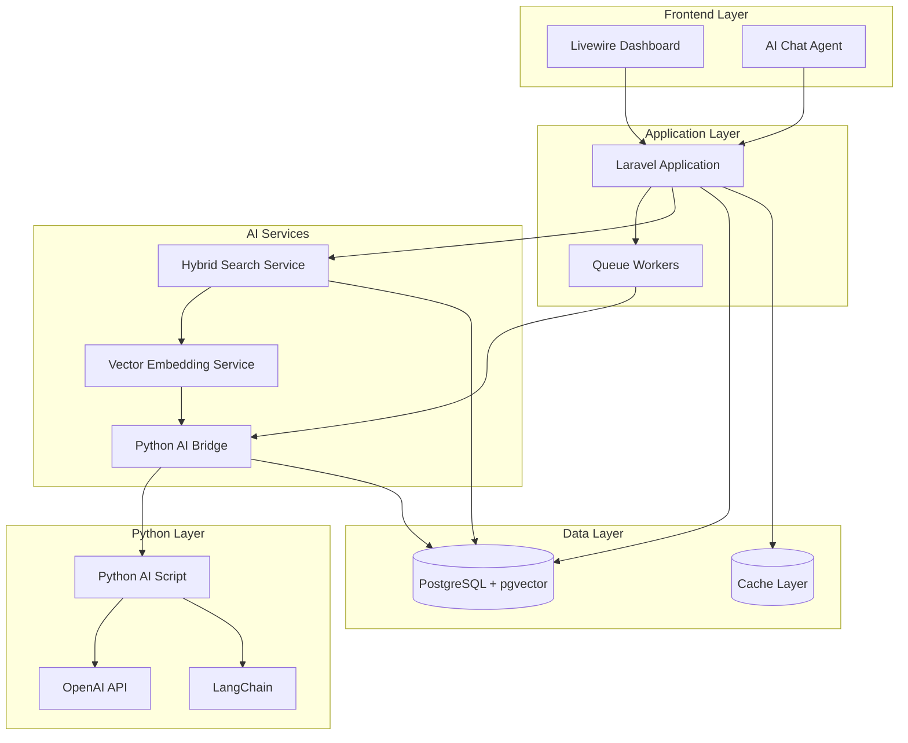
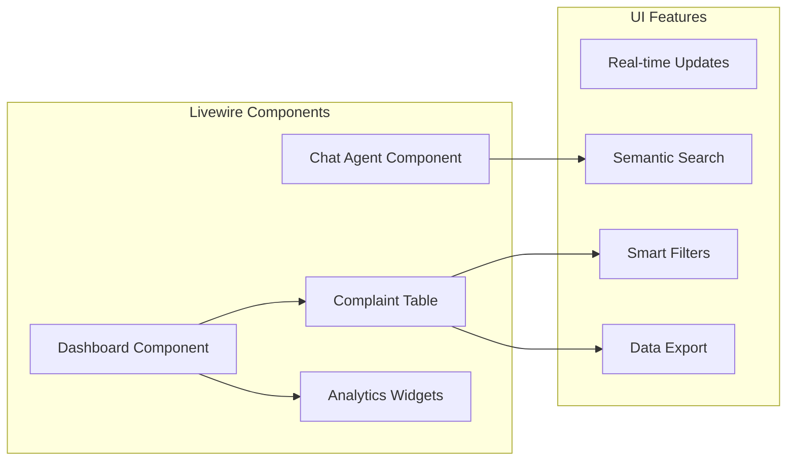
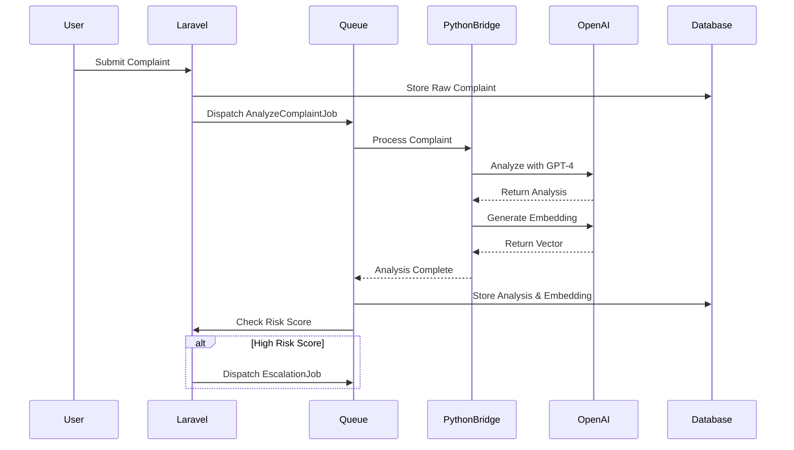
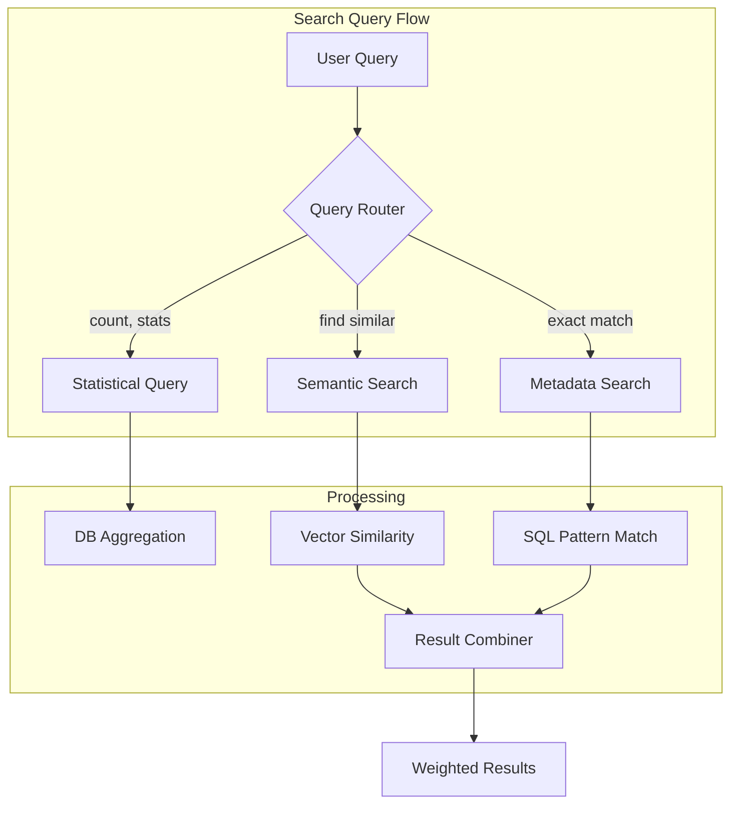
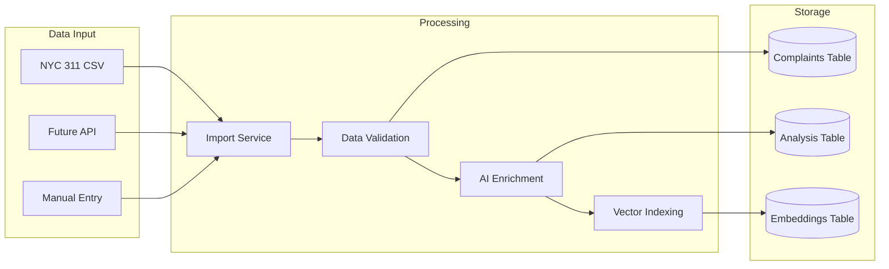
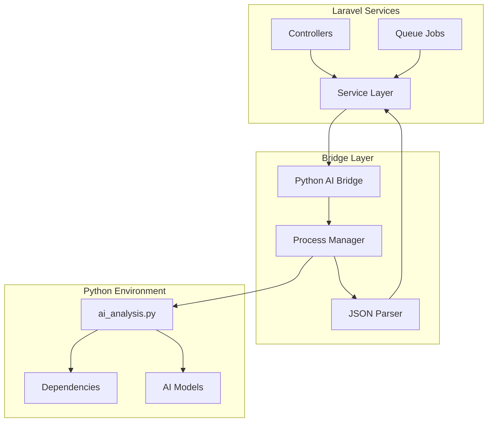
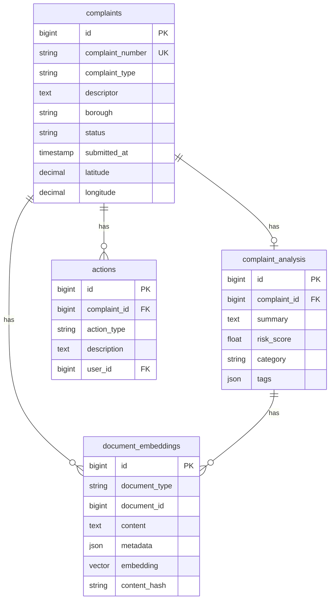
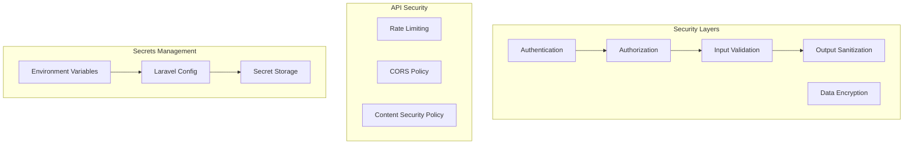
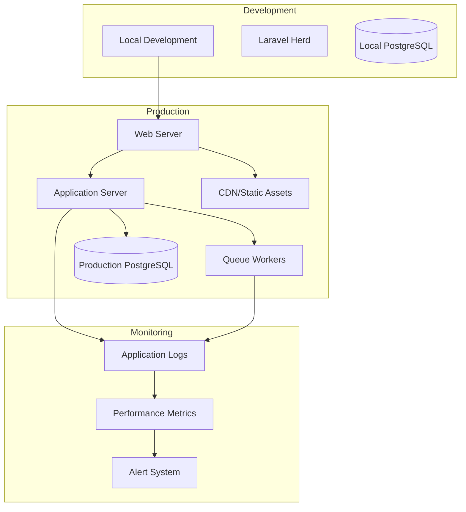

# LaraCity AI Architecture Documentation

## System Overview

LaraCity AI is an intelligent complaint management system that combines Laravel's robust framework with advanced AI capabilities to analyze, categorize, and prioritize NYC 311 complaints.

## Architecture Diagram

## Component Architecture

### 1. Frontend Layer

### 2. AI Processing Pipeline

### 3. Search Architecture

## Data Flow Architecture

### 1. Complaint Processing Flow

### 2. AI Service Integration

## Database Schema

## Technology Stack

### Core Framework
- **Laravel 11.x** - Modern PHP framework
- **Livewire 3.x** - Reactive UI components
- **PostgreSQL 15+** - Primary database with pgvector extension

### AI/ML Stack
- **OpenAI GPT-4** - Natural language processing
- **text-embedding-3-small** - Vector embeddings
- **LangChain** - AI orchestration
- **Python 3.9+** - AI processing runtime

### Infrastructure
- **Laravel Herd** - Local development environment
- **Queue Workers** - Asynchronous processing
- **Laravel Horizon** (optional) - Queue monitoring

## Security Architecture

## Deployment Architecture

## Performance Optimizations

### Caching Strategy
- **Query Results**: 15-minute cache for expensive aggregations
- **Vector Embeddings**: Content-hash based deduplication
- **API Responses**: Response caching for static data

### Queue Optimization
- **Priority Queues**: High-risk complaints processed first
- **Batch Processing**: Bulk embedding generation
- **Rate Limiting**: Respect API quotas

### Database Optimization
- **Indexes**: Strategic indexing on search fields
- **Partitioning**: Time-based partitioning for complaints
- **Connection Pooling**: Efficient database connections

## Scalability Considerations

1. **Horizontal Scaling**
   - Queue workers can be scaled independently
   - Read replicas for search operations
   - Load balancing for web traffic

2. **Vertical Scaling**
   - AI processing requires adequate memory
   - Vector operations benefit from CPU optimization
   - Database needs sufficient storage for embeddings

3. **Service Separation**
   - AI services can be extracted to microservices
   - Search can be moved to dedicated infrastructure
   - Static assets served from CDN

## Future Architecture Enhancements

1. **Real-time Features**
   - WebSocket integration for live updates
   - Streaming AI responses
   - Real-time collaboration

2. **Advanced AI Features**
   - Multi-modal analysis (images, audio)
   - Predictive analytics
   - Automated response generation

3. **Integration Possibilities**
   - Direct NYC 311 API integration
   - Third-party notification services
   - External analytics platforms